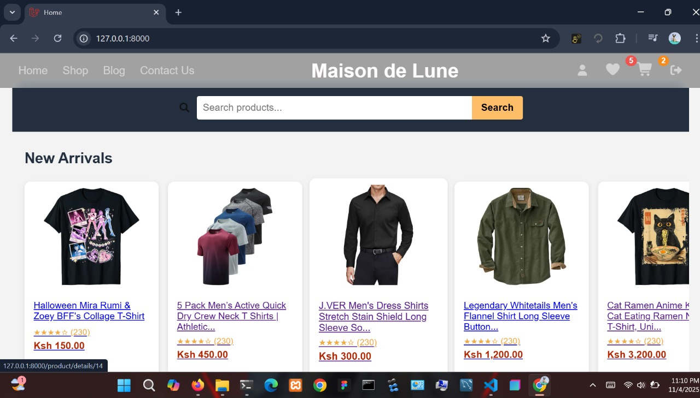
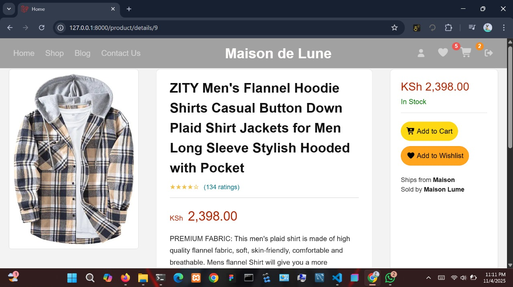
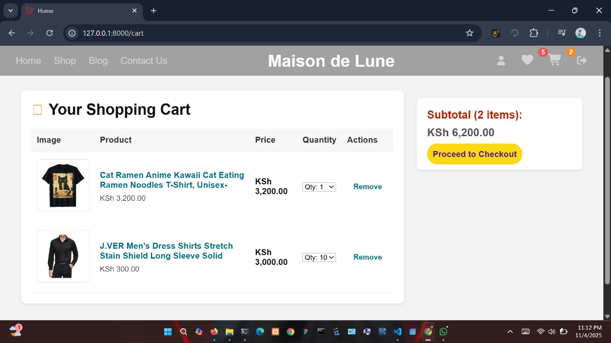
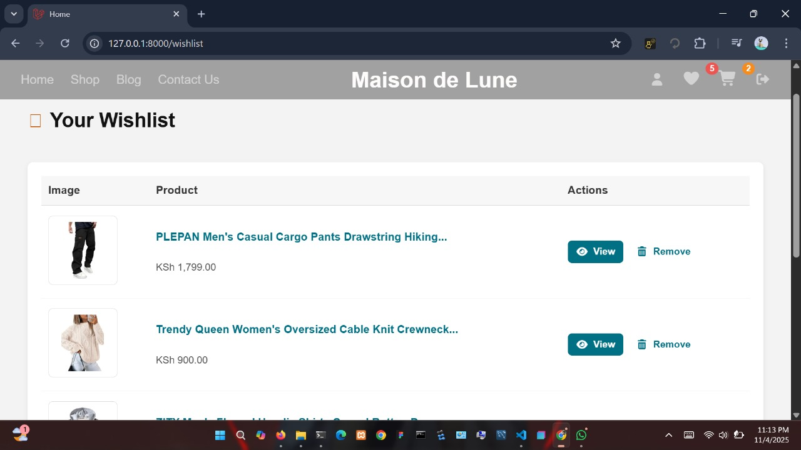
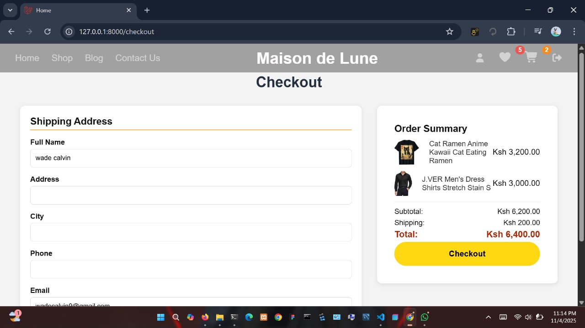
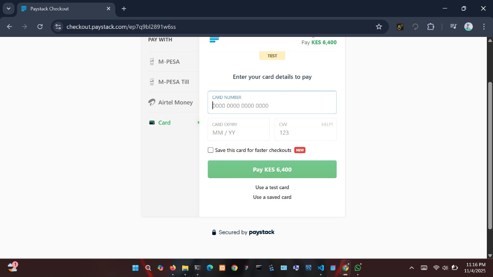

# 🛍️ Laravel E-Commerce Platform 

A modern and responsive ECommerce platform built with **Laravel**, featuring product listings, cart, wishlist, checkout flow, and **Paystack payment integrations**

---

## Screenshots

        

         

## 🚀 Features

- 🏠 Modern responsive homepage with Amazon-style layout  
- 🔍 Real-time product search  
- 🧺 Add to Cart & Wishlist functionality  
- 🛒 Checkout page with order summary  
- 💳 Paystack payment integration (no external packages)  
- 🔐 User authentication (login/register)  
- 📦 Dynamic product categories (New Arrivals, Sponsored, Others)

---

## 🧩 Tech Stack

| Layer | Technology |
|-------|-------------|
| Backend | Laravel 12.x |
| Frontend | Blade, HTML5, CSS3, JS |
| Database | MySQL |
| Payment | Paystack API |
| Authentication | Laravel Breeze / Jetstream (or built-in Auth) |

---

## ⚙️ Installation

### 1️⃣ Clone the Repository
```bash
git clone https://github.com/wadecalvin9/Ecommerce-platform.git
cd ecommerce-platform

```
2️⃣ Install Dependencies

```bash
composer install
npm install
npm run build
```
3️⃣ Configure Environment

Copy .env.example to .env:
```bash
cp .env.example .env
```
Then set up database and Paystack credentials:
```bash
APP_NAME="Ecommerce Platform"
APP_URL=http://localhost:8000

DB_CONNECTION=mysql
DB_HOST=127.0.0.1
DB_PORT=3306
DB_DATABASE=ecommerce
DB_USERNAME=root
DB_PASSWORD=

# Paystack Config
PAYSTACK_PUBLIC_KEY=pk_test_xxxxxxxxxxxxxxxxxxxxxxxxx
PAYSTACK_SECRET_KEY=sk_test_xxxxxxxxxxxxxxxxxxxxxxxxx
PAYSTACK_PAYMENT_URL=https://api.paystack.co
PAYSTACK_CALLBACK_URL=http://localhost:8000/paystack/callback
```
4️⃣ Run Migrations and Seed

```bash 
php artisan migrate --seed

```


5️⃣ Serve the Application


```bash 
php artisan serve

 ```

Access at: http://localhost:8000

## 💳 Paystack Integrations

This project uses the Paystack API directly, no external packages.

Example: PaymentController

```php
 public function initialize(Request $request)
{
    $user = auth()->user();
    $amount = $request->amount;

    $response = Http::withToken(config('services.paystack.secret_key'))
        ->post(config('services.paystack.payment_url') . '/transaction/initialize', [
            'email' => $user->email,
            'amount' => $amount * 100,
            'callback_url' => route('paystack.callback'),
        ]);

    return redirect($response->json()['data']['authorization_url']);
}
```
Example: Checkout Form

```html
<form action="{{ route('paystack.initialize') }}" method="POST">
    @csrf
    <input type="hidden" name="amount" value="{{ $totalAmount }}">
    <button type="submit" class="checkout-btn">Pay with Paystack</button>
</form>

```

```arduino
app/
├── Http/
│   ├── Controllers/
│   │   ├── CartController.php
│   │   ├── ProductController.php
│   │   └── PaymentController.php
│
resources/
├── views/
│   ├── home.blade.php
│   ├── checkout.blade.php
│   ├── cart.blade.php
│   └── layouts/
│       └── main.blade.php
│
public/
└── css/
    └── styles.css

```

## 🧠 Tips
## 💳 Test Card Details

You can use these **Paystack test cards** to simulate payments while in test mode.

| Card Type | Card Number | Expiry | CVV | PIN | Result |
|------------|--------------|--------|-----|-----|--------|
| ✅ Successful payment | 4084 0840 8408 4081 | 12/30 | 408 | 1234 | Success |
| ❌ Declined payment | 4084 0840 8408 4082 | 12/30 | 408 | 1234 | Declined |
| ⚠️ OTP Required | 4084 0840 8408 4084 | 12/30 | 408 | 1234 | Requires OTP |
| 💳 Insufficient funds | 4084 0840 8408 4083 | 12/30 | 408 | 1234 | Failure |

> 🧠 **Note:**  
> These test cards only work in **Paystack test mode** and do not process real transactions.


## 🧑‍💻 Contributing

Pull requests are welcome!
If you’d like to improve the styling or add more payment methods, feel free to open an issue.

## 📜 License

This project is open-sourced under the MIT License
.


## 🌍 Author

💼 wadecalvin9

✉️ wadecalvin9@gmail.com
